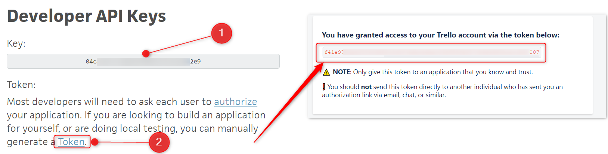

# Keptn Trello Service
This Keptn Service integrates Atlassian Trello with Keptn.

This keptn service creates cards on Trello boards when a keptn evaluation (`sh.keptn.event.start-evaluation`) is performed. The service subscribes to the following keptn events:

* `sh.keptn.events.evaluation-done`

# Gather Trello Information

1. Go to https://trello.com/app-key and make a note of your `api-key`.
2. Click on the `Token` link and follow the wizard. Then make a note of your `api-token`.


3. Create a board and make a note of the `board-id` from the URL.

4. Make a note of the (case sensitive) list name on your board. The keptn evaluation results will appear on this list.
eg. ('To Do')



# Debugging
A debug log is available in the `trello-service` pod at `/var/www/html/logs/trelloService.log`

```
kubectl exec -itn keptn trello-service-*-* cat /var/www/html/logs/trelloService.log
```

# Save Trello Details as k8s Secret
Paste your values into the command below (replacing `***`) and save the Trello details into a secret called `trello-details` in the `keptn` namespace.

```
kubectl create secret generic trello-details -n keptn --from-literal=api-key='***' --from-literal=api-token='***' --from-literal=board-id='***' --from-literal=list-name='***'
```

Expected output:

```
secret/trello-details created
```

# Install Trello Service
Clone this repository and apply the `trello-service.yaml` and `trello-distributor.yaml` file to install the service on to keptn.

```
kubectl apply -f ~/trello-service/trello-distributor.yaml -f ~/trello-service/trello-service.yaml
```

Expected output:

```
deployment.apps/trello-service-distributor created
deployment.apps/trello-service created
service/trello-service created
```

# Verification of Installation
```
kubectl -n keptn get pods | grep trello
```

Expected output:

```
trello-service-*-*                   1/1     Running   0   8s
trello-service-distributor-*-*       1/1     Running   0   8s
```

Now start an evaluation and wait for the ticket to be created.
Note: You must have your services tagged with `keptn_deployment`, `keptn_project`, `keptn_service` and `keptn_stage`.

```
keptn send event start-evaluation --project=*** --stage=*** --service=*** --timeframe=2m
```

# Compatibility Matrix

| Keptn Version    | Trello API Version |
|:----------------:|:----------------------:|
|     0.6.1        |            v1          |

# Contributions, Enhancements, Issues or Questions
Please raise a GitHub issue or join the [Keptn Slack channel](https://join.slack.com/t/keptn/shared_invite/enQtNTUxMTQ1MzgzMzUxLWMzNmM1NDc4MmE0MmQ0MDgwYzMzMDc4NjM5ODk0ZmFjNTE2YzlkMGE4NGU5MWUxODY1NTBjNjNmNmI1NWQ1NGY).
